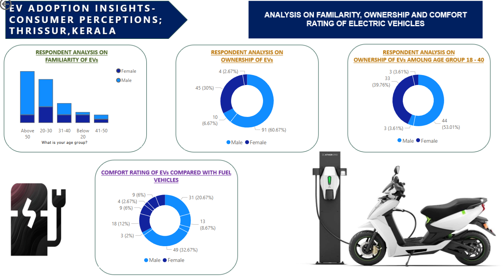
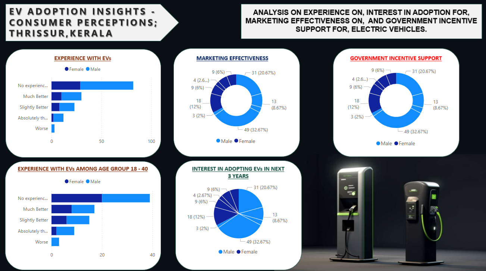
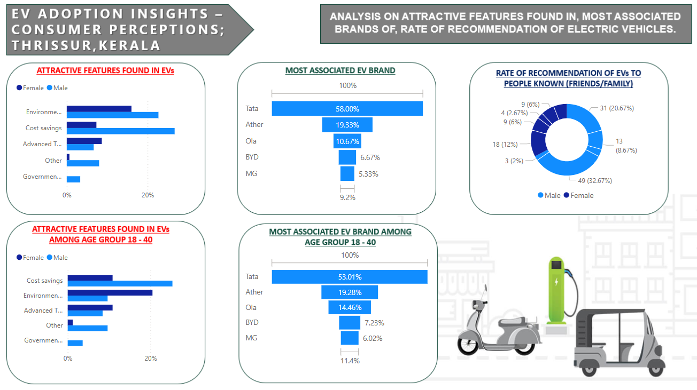
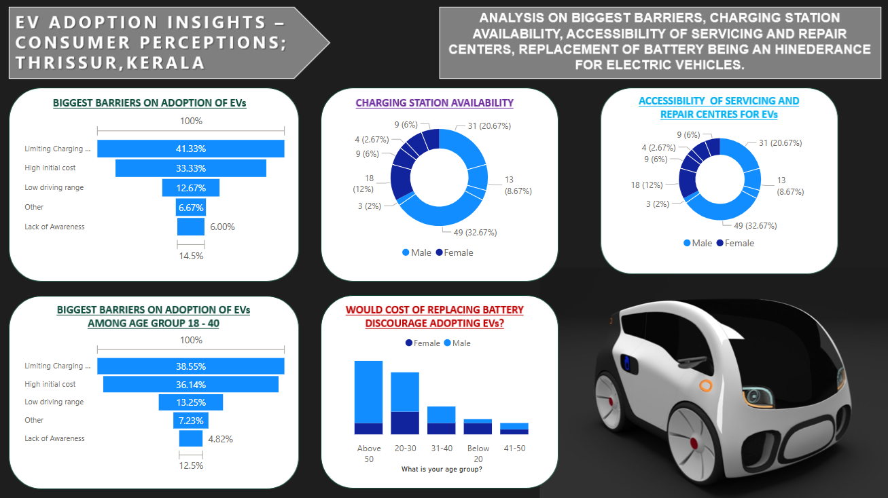

# 🚗 Study on Adoption and Marketing of Electric Vehicles (EVs) in Thrissur, Kerala

This repository contains the research project I completed as part of my final-year MBA in Marketing, titled **"Study on Adoption and Marketing of Electric Vehicles (EVs) in Thrissur District, Kerala."** The project was conducted under the guidance of **Mrs. Jyothis Racheal Mathews**, Professor at **Ahalia School of Management, Palakkad**.

---

## 📌 Project Overview

The objective of this study was to understand the awareness, perceptions, adoption behavior, and marketing outlook of Electric Vehicles (EVs) among the general population of Thrissur, Kerala. The research focuses on identifying key barriers to EV adoption and offers strategic insights to improve consumer engagement and policy-level support.

---

## 🔍 Research Highlights

- 🧑‍🏫 **Guided by**: *Mrs. Jyothis Racheal Mathews*, Ahalia School of Management, Palakkad
- 📋 **Primary Research** with **150 responses** via [Google Forms Questionnaire](https://forms.gle/CapZgGTBrhDzDyBN8)
- 📊 **Quantitative data analysis** using **Excel Pivot Tables**
- 📈 **Power BI dashboards** for interactive visualization & storytelling
- 🎯 **Focused analysis** on Gen Z and Millennials (ages 18–40)
- 📝 **Comprehensive report** in DOCX & PDF formats

---

## 📝 Survey Questionnaire

The survey consisted of 20 structured questions focused on awareness, preferences, and concerns related to EVs.

👉 [View the Google Form Questionnaire](https://forms.gle/CapZgGTBrhDzDyBN8)

---

## 🗂️ Repository Contents

- `/PowerBI_Dashboard/`: Power BI `.pbix` file + dashboard screenshots
- `/Survey_Data/`: Excel file with cleaned survey responses
- `/Reports/`: Final research report (PDF & DOCX)
- `/Visualizations/`: (Optional) Exported charts/images if separate from dashboard

---

## 📊 Power BI Visualizations

Interactive visualizations were created in Power BI to represent patterns in EV awareness, preferences, barriers, and generational behavior.

### 📁 Power BI File
- `Consumer perception study on adoption and marketing of EVs in Thrissur, Kerala..pbix` – Open with Power BI Desktop to explore all dashboards and insights.

### 📸 Dashboard Snapshots

## Analysis on Respondent and Gender Analysis

## Analysis on Familiarity, Ownership, and Comfort Rating

## EV Experience, Adoption Interest, Marketing Effectiveness & Government Incentives

## EV Features, Brand Association & Recommendation Rates

## EV Barriers: Charging Availability, Battery Replacement & Service Accessibility

> 🔁 *Make sure image names and paths match your actual files in the repo.*

---

## 🧠 Tools & Skills Demonstrated

- ✅ Power BI – Dashboard creation & data storytelling
- ✅ Excel – Data cleaning, Pivot Table analysis, segmentation
- ✅ Google Forms – Primary survey design and distribution
- ✅ Marketing analysis – Consumer behavior & segmentation
- ✅ Insight generation – Barriers, motivators, and strategic recommendations
- ✅ Report writing – Professional research documentation

---

## 📈 Summary

This project reflects end-to-end research capabilities: from survey design and data collection to data analysis, visualization, and insight generation. It showcases a practical application of marketing research and data analysis skills in a real-world context.

**As I step into the next phase of my career, I aim to apply these skills to drive data-informed strategies that create real-world marketing impact.**

---

## 🙏 Acknowledgements

- 🎓 *Mrs. Jyothis Racheal Mathews* – Project guide and faculty mentor  
- 📍 *Indira Gandhi Open National University (IGNOU),Thrissur, Kerala* –  Study Centre support  
- 🙌 *150 respondents* from Thrissur district – For contributing their valuable time and input

---

## 📘 License

This repository is intended for academic and educational purposes. Feel free to reference this work, with appropriate attribution.

